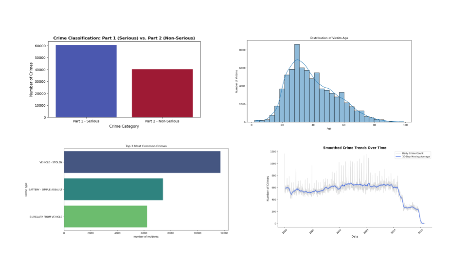

# Crime Data Cleaning, Analysis, and Classification

## Overview
[This dataset](https://data.lacity.org/Public-Safety/Crime-Data-from-2020-to-Present/2nrs-mtv8/about_data) reflects incidents of crime in the City of Los Angeles dating back to 2020. This data is transcribed from original crime reports that are typed on paper and therefore there may be some inaccuracies within the data.

This project analyzes crime data, identifies trends, and builds a classification model to predict serious and non-serious crime types based on location, time, and victim demographics.

## [Data Processing](https://github.com/aymanibrahim/lacrime/blob/main/notebooks/clean_data.ipynb)
- **Cleaning:** Handled missing values, corrected data types , and standardized categorical values.
- **Feature Engineering:** Extracted time-based features (hour, day, month), encoded categorical variables, and removed irrelevant columns.
- **Visualization:** Created bar charts, and trend lines for insights on crime distribution.

## [Exploratory Data Analysis (EDA)](https://github.com/aymanibrahim/lacrime/blob/main/notebooks/analyze_data.ipynb)
- **Temporal Trends:** Smoothed crime trends over time and analyzed hourly crime distribution.
- **Victim Demographics:** Studied crime patterns by age, gender, and descent.

## [Classification Model](https://github.com/aymanibrahim/lacrime/blob/main/notebooks/build_model.ipynb)
- **Objective:** Predict crime type (serious/non-serious)
- **Features Used:** Location (lat/lon), time (hour, day), and victim demographics.
- **Preprocessing:** Standardized numerical features and encoded categorical values.
- **Evaluation Metrics:**
  - **Accuracy:** ~61%
  - **Precision/Recall:** Analyzed class-wise performance.
  - **Feature Importance:** Assessed impact of various factors on crime classification.
